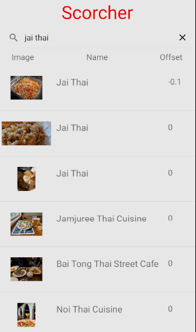
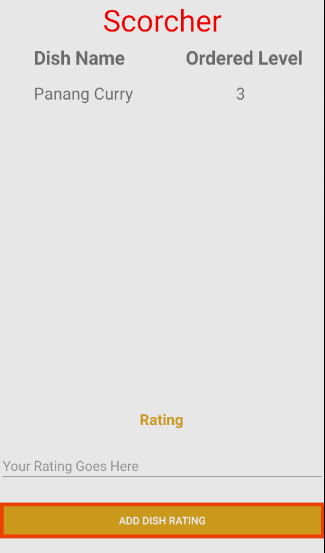
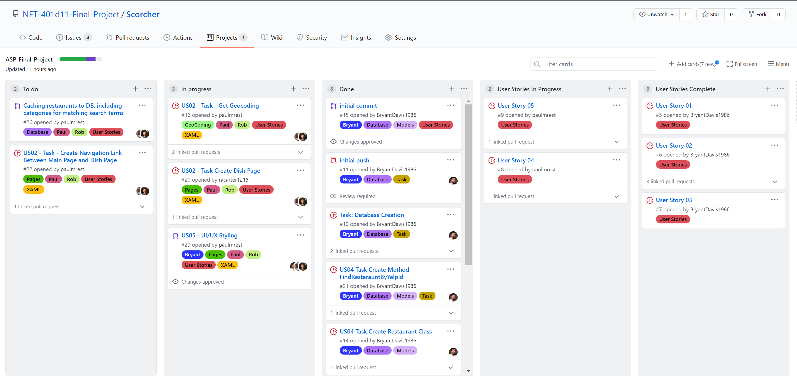
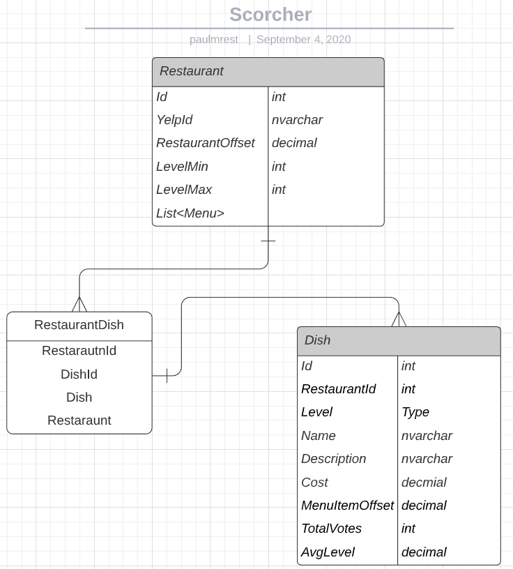
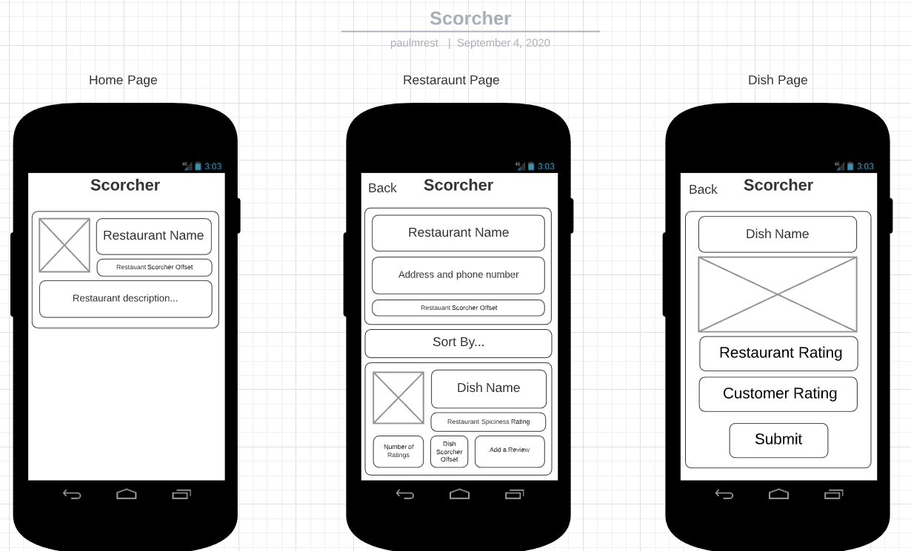
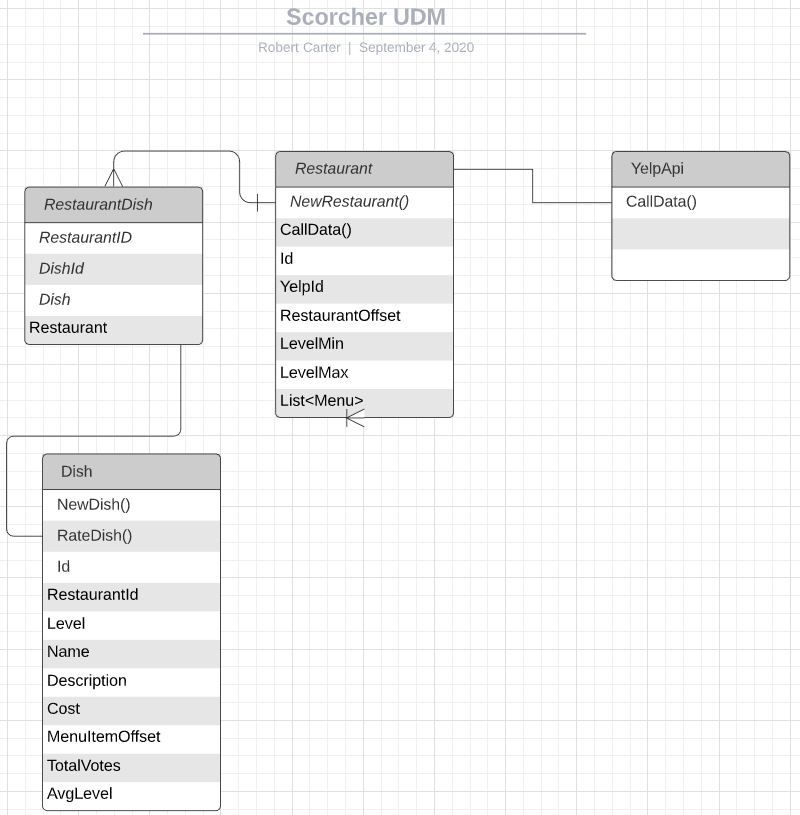

# Scorcher

## Authors:
- *[Robert Carter](https://www.linkedin.com/in/robert-carter-035baa165/)*
- *[Bryant C. Davis](https://www.linkedin.com/in/bryantdavis-sd/)*
- *[Paul M Rest](https://www.linkedin.com/in/paulmichaelrest/)*

# Table of Contents

| Link     |Name       |
|:----------|:-----------------------------------------------------------------------------|
|[MVP](#mvp)    |Minimal Viable Product          |
|[Stretch Goals](#stretch)    |The Projects Goals beyond MVP          |
|[Technologies](#technologies)    |The Projects Technologies that were used          |
|[Getting Started](#getting-started)    |How to get started when running the application          |
|[Running the Program](#to-run-the-program-from)    |How to run the program using Visual Studio          |
|[Screenshots](#screenshots)    |Screenshots          |
|[Projects](#projects)    |The Project Board associated with Scorcher          |
|[ERD](#erd)    |Entity Relationship Diagram         |
|[Wireframe](#wireframe)    |Wireframe layout for each Page         |
|[Domain Model](#domain-model)    |Domain Model         |
|[Guides and Resources](#guides-resources)    |Guides and Resources Used        |

---

## Description

A Xamarin Android app to rate how spicy dishes at restaurants are compared to the restaurant's 
spiciness level. App gives an offset for the restaurant as a whole (so how under or over spiced 
their dishes are compared to the ordered spiciness level).

Employs Yelp to get restaurant data. Dish data is presently manually seeded.

Datastore uses Xamarin.Forms Local Database's SQLite.

## Goals

### MVP:

- Able to browse restaurants and dishes, including the overall rating
- Able to rate the relative spiciness of a dish

### Stretch:

With more time, we would have implemented the following:
- API backend with a unified SQL database.
- Identity, user profiles, and the ability to log in.
- Able to alter the default search radius.
- Web front-end.

## Technologies:

- C# & XAML
- Xamarin
- Xamarin Essentials 
- Android Emulator
- SQLite
- Yelp.API

---

## Getting Started
Clone this repository to your local machine.

In a command line environment with Git installed:

```
git clone GIT REPO URL HERE
```

### To Run the Program from Visual Studio (2019):

BEFORE opening solution:

- Install "Mobile Development with .NET" (Tools -> Get Tools and Features) to allow running Xamarin apps.
- Download and configure an Android emulator ([Microsoft Guide](https://docs.microsoft.com/en-us/xamarin/android/get-started/installation/android-emulator/)).

Select ```File``` -> ```Open``` -> ```Project/Solution```

Next navigate to the directory you cloned the repository to.

Double click on the ```Scorcher``` directory.

Then select and open ```Final-Project-Scorcher```

Select an Android emulator to run the app on.

Select ```Debug``` -> ```Start Debugging``` to the run the app with the debugger

OR

Select ```Debug``` -> ```Start Without Debugging```

---

## Screenshots

  

## Github Projects
[github-projects](https://github.com/NET-401d11-Final-Project/401-Final-Project/projects)



## ERD 


## Wireframe


## Domain Model


---

## Guides and Resources
* CalculateLocationRadius Method in ScorcherDatabase provided by https://www.movable-type.co.uk/scripts/latlong.html
